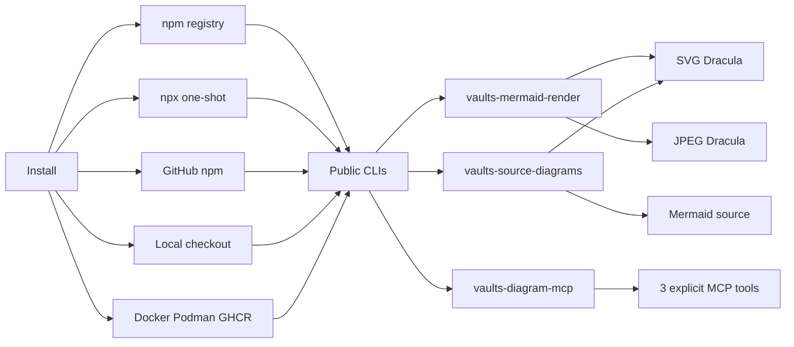
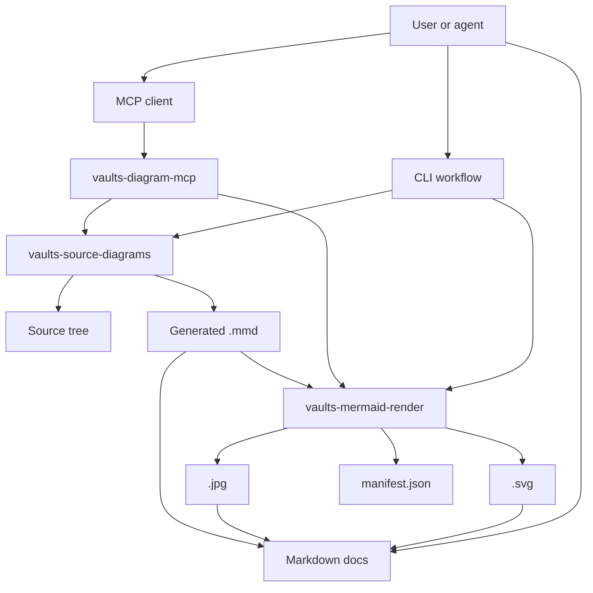
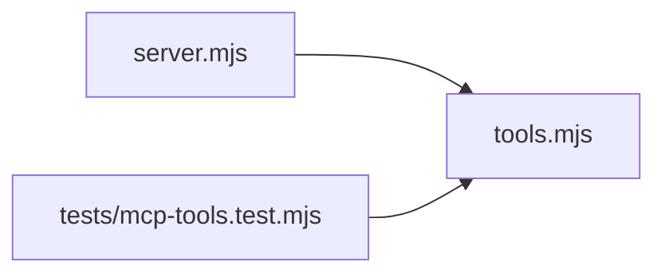
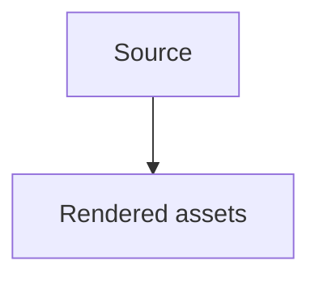

# vaults-diagram-tools

[](https://github.com/malnati/vaults-diagram-tools/actions/workflows/ci.yml)
[](https://github.com/malnati/vaults-diagram-tools/actions/workflows/release.yml)
[](LICENSE)
[](package.json)
[](https://malnati.github.io/vaults-diagram-tools/)
[](https://github.com/malnati/vaults-diagram-tools/pkgs/container/vaults-diagram-tools)

Mermaid to assets. Source code to maps. MCP for agents.

`vaults-diagram-tools` is a standalone toolkit for teams that need reproducible Mermaid SVG/JPEG assets, source-code diagrams, and agent-friendly diagram workflows without carrying Vault-specific content.

- [GitHub Pages documentation](https://malnati.github.io/vaults-diagram-tools/)
- [npm package `vaults-diagram-tools@0.1.3`](https://www.npmjs.com/package/vaults-diagram-tools/v/0.1.3)
- [MCP Registry `io.github.Malnati/vaults-diagram-tools`](https://registry.modelcontextprotocol.io/v0/servers?search=io.github.Malnati%2Fvaults-diagram-tools)
- [Smithery server](https://smithery.ai/servers/ricardomalnati/vaults-diagram-tools)
- [GitHub release v0.1.1](https://github.com/malnati/vaults-diagram-tools/releases/tag/v0.1.1)
- [GitHub App](https://github.com/apps/vaults-diagram-tools)
- [Homebrewery package page](https://homebrewery.naturalcrit.com/share/J1w1-EjqPAr9)

## What is included

- Mermaid renderer extracted from the Vaults toolchain.
- Source-code to Mermaid diagram generator.
- MCP stdio server with three explicit tools, published in MCP Registry as `io.github.Malnati/vaults-diagram-tools`.
- Offline-capable release assets for zip and container distribution.
- Packaging templates for Homebrew, deb/rpm, VS Code, CDN, Docker, and Podman.

Content-management workflows outside diagram generation are not part of this package.

## Quick start

Install in a project:

```bash
npm install -D vaults-diagram-tools
```

Render one Mermaid source to durable assets:

```bash
npx vaults-mermaid-render path/to/diagram.mmd --output-dir out --manifest out/manifest.json
```

Generate Mermaid diagrams from source code:

```bash
npx vaults-source-diagrams --source-dir src --output-dir diagrams
```

Run the MCP stdio server:

```bash
npx vaults-diagram-mcp
```

Use one-shot `npx` when the project should not keep a dependency:

```bash
npx --yes --package vaults-diagram-tools vaults-mermaid-render path/to/diagram.mmd --output-dir out
npx --yes --package vaults-diagram-tools vaults-source-diagrams --source-dir src --output-dir diagrams
npx --yes --package vaults-diagram-tools vaults-diagram-mcp
```

## Core tools

| Command | Purpose |
| --- | --- |
| `vaults-mermaid-render` | Render `.mmd` or `.mermaid` files to SVG/JPEG, manifests, and optional PNG/text sidecars. |
| `vaults-source-diagrams` | Generate Mermaid diagrams from source-code structure, including focused selections and traceability metadata. |
| `vaults-diagram-mcp` | Expose `render_mermaid_text`, `render_mermaid_file`, and `generate_source_diagrams` through MCP stdio. |

Additional package binaries are compatibility entrypoints for older Vaults paths, optional text renderers, and Podman workflows.

## Workflows

- **Markdown docs:** keep the Mermaid source as a linked `.mmd`, render `.svg` and `.jpg`, and show source inline with a fenced `mermaid` block.
- **Source graph reviews:** generate diagrams from real source paths and inspect manifest selection data for requested files, omitted connectors, and rendered outputs.
- **Agent automation:** use the MCP server when clients need diagram rendering through a narrow, explicit tool surface. Current registry entry is active at version `0.1.3`, and the Smithery server page is already published.
- **Release packaging:** ship npm, zip, container, and offline vendor artifacts while preserving license and notice files.

## Download and distribution

### npm registry

Use the published npm package when you want the normal Node.js toolchain installation. Current npm latest is [`vaults-diagram-tools@0.1.3`](https://www.npmjs.com/package/vaults-diagram-tools/v/0.1.3):

```bash
npm install -D vaults-diagram-tools
npx vaults-mermaid-render path/to/diagram.mmd --output-dir out --manifest out/manifest.json
npx vaults-source-diagrams --source-dir src --output-dir diagrams
npx vaults-diagram-mcp
```

### One-shot with `npx`

Use `--package` when the project should not keep the dependency:

```bash
npx --yes --package vaults-diagram-tools vaults-mermaid-render path/to/diagram.mmd --output-dir out
npx --yes --package vaults-diagram-tools vaults-source-diagrams --source-dir src --output-dir diagrams
npx --yes --package vaults-diagram-tools vaults-diagram-mcp
```

### npm package from GitHub

Use the GitHub package source when testing a commit before a registry release:

```bash
npm install github:malnati/vaults-diagram-tools
npx vaults-mermaid-render path/to/diagram.mmd --output-dir out
```

### GitHub release assets

The latest GitHub Release and GHCR image remain `v0.1.1`; npm and MCP Registry metadata have advanced to `0.1.3`:

- [vaults-diagram-tools-0.1.1.tgz](https://github.com/Malnati/vaults-diagram-tools/releases/download/v0.1.1/vaults-diagram-tools-0.1.1.tgz)
- [vaults-diagram-tools-0.1.1.zip](https://github.com/Malnati/vaults-diagram-tools/releases/download/v0.1.1/vaults-diagram-tools-0.1.1.zip)
- `ghcr.io/malnati/vaults-diagram-tools:v0.1.1`

### Local checkout

Use the checkout for development, validation, or release preparation:

```bash
git clone https://github.com/malnati/vaults-diagram-tools.git
cd vaults-diagram-tools
npm ci
npm test
node packages/renderer/render-mermaid-assets.mjs examples/simple/flowchart.mmd --output-dir tmp/rendered
node packages/source-diagrams/source-diagrams.mjs --source-dir packages/mcp --output-dir tmp/source-diagrams
node packages/mcp/server.mjs
```

### Container, Docker, and Podman

Build locally:

```bash
docker build -f containers/Containerfile -t vaults-diagram-tools:local .
podman build -f containers/Containerfile -t vaults-diagram-tools:local .
```

Run a render from a container image:

```bash
docker run --rm \
  -v "$PWD/examples/simple:/work/input:ro" \
  -v "$PWD/tmp/container-output:/work/output:rw" \
  ghcr.io/malnati/vaults-diagram-tools:v0.1.1 \
  --output-dir /work/output /work/input/flowchart.mmd
```

Podman helper scripts are available through `vaults-mermaid-podman-build`, `vaults-mermaid-podman-render`, and `vaults-mermaid-podman-test`.

### CDN facade

The package is CLI-first. CDN endpoints expose browser-safe metadata/helpers only; SVG/JPEG rendering still runs through Node.js, MCP, or the container runtime.

```text
https://cdn.jsdelivr.net/npm/vaults-diagram-tools/packaging/cdn/vaults-diagram-tools.mjs
https://unpkg.com/vaults-diagram-tools/packaging/cdn/vaults-diagram-tools.mjs
```

## Command line usage

After installing from npm, run public CLIs directly from `node_modules/.bin`, `npm exec`, or `npx`:

```bash
vaults-mermaid-render path/to/diagram.mmd --output-dir out --png --ascii --manifest out/manifest.json
vaults-source-diagrams --source-dir src --output-dir diagrams --langs auto --diagrams dependency,class
vaults-diagram-mcp
```

One-shot examples:

```bash
npx --yes --package vaults-diagram-tools vaults-mermaid-render examples/simple/flowchart.mmd --output-dir tmp/vaults-diagram-tools
npx --yes --package vaults-diagram-tools vaults-source-diagrams --source-dir packages/mcp --output-dir tmp/source-diagrams --render-mode placeholder
npx --yes --package vaults-diagram-tools vaults-diagram-mcp
```

Local checkout equivalents:

```bash
node packages/renderer/render-mermaid-assets.mjs examples/simple/flowchart.mmd --output-dir tmp/vaults-diagram-tools
node packages/source-diagrams/source-diagrams.mjs --source-dir packages/mcp --output-dir tmp/source-diagrams
node packages/mcp/server.mjs
```

## MCP tools

`vaults-diagram-mcp` exposes exactly three tools:

- `render_mermaid_text`
- `render_mermaid_file`
- `generate_source_diagrams`

Example client command:

```bash
vaults-diagram-mcp
```

The MCP adapter passes theme and rendering options through to the same renderer used by the CLI, so a client can request `theme: "dracula"` and receive `.svg` + `.jpg` artifacts.

## Dracula diagram examples

The diagrams below were generated by this repository with `vaults-mermaid-render --theme dracula`; Markdown links the generated assets instead of embedding SVG/JPEG.

#### Install and usage flow
- Links: [Mermaid source](docs/assets/diagrams/install-usage-flow.mmd) / [SVG](docs/assets/diagrams/install-usage-flow.svg) / [JPEG](docs/assets/diagrams/install-usage-flow.jpg)



#### Tooling architecture
- Links: [Mermaid source](docs/assets/diagrams/tooling-architecture.mmd) / [SVG](docs/assets/diagrams/tooling-architecture.svg) / [JPEG](docs/assets/diagrams/tooling-architecture.jpg)



#### MCP package source graph
- Links: [Generated index](docs/assets/diagrams/mcp-source/INDEX.md) / [Mermaid source](docs/assets/diagrams/mcp-source/javascript/dependency.mmd) / [SVG](docs/assets/diagrams/mcp-source/javascript/dependency.svg) / [JPEG](docs/assets/diagrams/mcp-source/javascript/dependency.jpg)



## Compliance and artifact policy

### Markdown diagram policy

Generated Markdown should link artifacts and show source in a `mermaid` fenced block:

````markdown
#### Diagram title
- Links: [Mermaid source](docs/assets/diagrams/install-usage-flow.mmd) / [SVG](docs/assets/diagrams/install-usage-flow.svg) / [JPEG](docs/assets/diagrams/install-usage-flow.jpg)


````

SVG and JPEG files are delivery artifacts. Markdown should link them instead of embedding them as images by default.

### Credits and license compliance

- Project license: [MIT](LICENSE).
- Project notices: [NOTICE.md](NOTICE.md).
- Third-party credits and license index: [THIRD_PARTY_NOTICES.md](THIRD_PARTY_NOTICES.md).
- License verification: `npm run license:check`; refresh generated notices with `npm run license:generate`.
- Dracula-colored documentation diagrams credit the MIT-licensed Dracula Theme palette through `beautiful-mermaid`.
- Icon data credits include Font Awesome 4, SVG Logos by Gil Barbara, and Lucide Icons via Iconify JSON packages.
- Release artifacts must preserve `LICENSE`, `NOTICE.md`, `THIRD_PARTY_NOTICES.md`, and upstream license files bundled by packaged dependencies or the offline vendor runtime.

## Offline vendor runtime

The source tree does not commit `node_modules`. Build and release jobs create offline vendor assets with:

```bash
npm run vendor:refresh
npm run test:vendor:offline
```

The renderer can run from normal npm dependencies during development, or from `packages/renderer/vendor/node` when `MMDC_VENDOR_ONLY=1`.

The default renderer is the Node/JS/WASM vendor path and does not require Chromium, Puppeteer, `mmdc`, ImageMagick, or `npx`. The legacy shell wrapper only uses `mmdc` when explicitly requested with `MMDC_RENDER_ENGINE=mmdc`; automatic fallback to Puppeteer is disabled.

## GitHub App

The public [`vaults-diagram-tools`](https://github.com/apps/vaults-diagram-tools) GitHub App is the installable read-only app surface for this package.

- Install URL: <https://github.com/apps/vaults-diagram-tools/installations/new>
- Purpose: read-only installs for validating tags, release assets, and package metadata around this repository.
- Permissions: repository contents read-only, plus GitHub metadata access.
- Webhooks: disabled; this release does not run a webhook backend.
- Marketplace: not listed in GitHub Marketplace for the current package line.
- Secrets: no private key, client secret, or webhook secret is stored in this repository.

## Distribution status

Working in v1:

- npm package publication and GitHub install flow
- Docker/Podman image
- MCP server
- MCP Registry entry `io.github.Malnati/vaults-diagram-tools` active at version `0.1.3`
- Smithery server page for `ricardomalnati/vaults-diagram-tools`
- zip release
- GitHub Actions CI, release, CodeQL, and Pages workflows
- Public read-only GitHub App install surface
- Homebrewery package page with searchable tags

Templates in v1:

- Homebrew formula
- deb/rpm through nfpm
- VS Code extension shell
- CDN facade through npm/jsDelivr/unpkg

## Current release

`vaults-diagram-tools` is published as npm `0.1.3` and MCP Registry server `io.github.Malnati/vaults-diagram-tools` version `0.1.3`. The latest GitHub Release and GHCR image remain `v0.1.1`.

| Channel | Status |
| --- | --- |
| GitHub Release | [`v0.1.1`](https://github.com/Malnati/vaults-diagram-tools/releases/tag/v0.1.1) |
| Release assets | [`vaults-diagram-tools-0.1.1.tgz`](https://github.com/Malnati/vaults-diagram-tools/releases/download/v0.1.1/vaults-diagram-tools-0.1.1.tgz) and [`vaults-diagram-tools-0.1.1.zip`](https://github.com/Malnati/vaults-diagram-tools/releases/download/v0.1.1/vaults-diagram-tools-0.1.1.zip) |
| npm | [`vaults-diagram-tools@0.1.3`](https://www.npmjs.com/package/vaults-diagram-tools/v/0.1.3), dist-tag `latest` |
| MCP Registry | [`io.github.Malnati/vaults-diagram-tools`](https://registry.modelcontextprotocol.io/v0/servers?search=io.github.Malnati%2Fvaults-diagram-tools), status `active`, version `0.1.3` |
| Smithery | [`ricardomalnati/vaults-diagram-tools`](https://smithery.ai/servers/ricardomalnati/vaults-diagram-tools) is published |
| Registry PR | [PR #17](https://github.com/Malnati/vaults-diagram-tools/pull/17) aligned the MCP Registry publisher name and was merged. |
| Container | [`ghcr.io/malnati/vaults-diagram-tools:v0.1.1`](https://github.com/malnati/vaults-diagram-tools/pkgs/container/vaults-diagram-tools) |
| Automation | [CI](https://github.com/Malnati/vaults-diagram-tools/actions/workflows/ci.yml), [CodeQL](https://github.com/Malnati/vaults-diagram-tools/actions/workflows/codeql.yml), [Pages](https://github.com/Malnati/vaults-diagram-tools/actions/workflows/pages.yml), and [Release](https://github.com/Malnati/vaults-diagram-tools/actions/workflows/release.yml) workflows are published through GitHub Actions. |
| GitHub App | [`vaults-diagram-tools`](https://github.com/apps/vaults-diagram-tools) public read-only app; [install](https://github.com/apps/vaults-diagram-tools/installations/new). |
| Documentation | [GitHub Pages](https://malnati.github.io/vaults-diagram-tools/) publishes the `docs/` site. |

## Documentation

- [GitHub Pages documentation](https://malnati.github.io/vaults-diagram-tools/)
- [Markdown source for the landing page](docs/index.md)
- [Vaults compatibility notes](docs/vaults-compatibility.md)
- [Homebrewery package page](https://homebrewery.naturalcrit.com/share/J1w1-EjqPAr9)
- [npm package `vaults-diagram-tools@0.1.3`](https://www.npmjs.com/package/vaults-diagram-tools/v/0.1.3)
- [MCP Registry entry](https://registry.modelcontextprotocol.io/v0/servers?search=io.github.Malnati%2Fvaults-diagram-tools)
- [Smithery server](https://smithery.ai/servers/ricardomalnati/vaults-diagram-tools)
- [GitHub release v0.1.1](https://github.com/malnati/vaults-diagram-tools/releases/tag/v0.1.1)
- [GitHub App](https://github.com/apps/vaults-diagram-tools)
- [Contributing guide](CONTRIBUTING.md)
- [Security policy](SECURITY.md)
