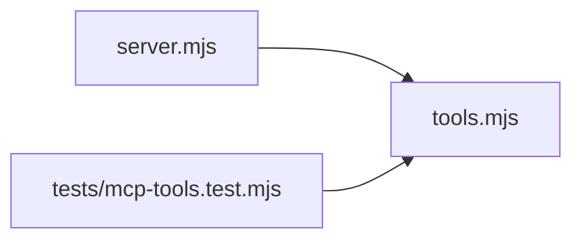

# Source diagrams

Generated at 2026-05-04T04:05:25.412Z.

#### JavaScript — dependency
- Adapter: `javascript-heuristic-dependency`; confidence: `heuristic`.
- Links: [Mermaid source](javascript/dependency.mmd) / [SVG](javascript/dependency.svg) / [JPEG](javascript/dependency.jpg)

