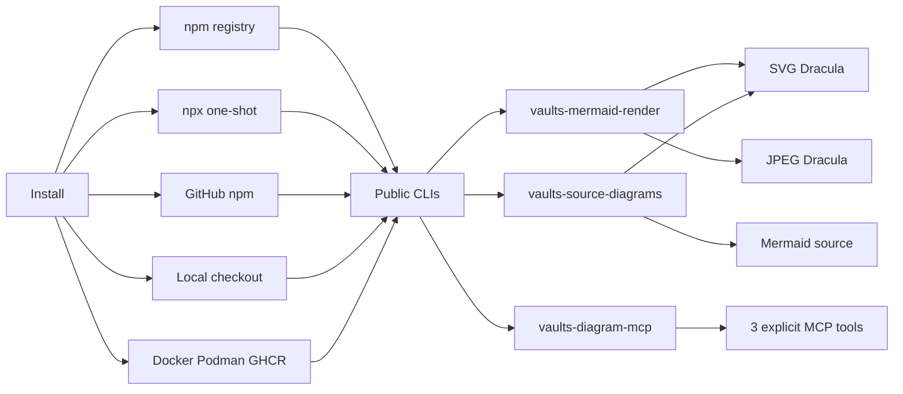
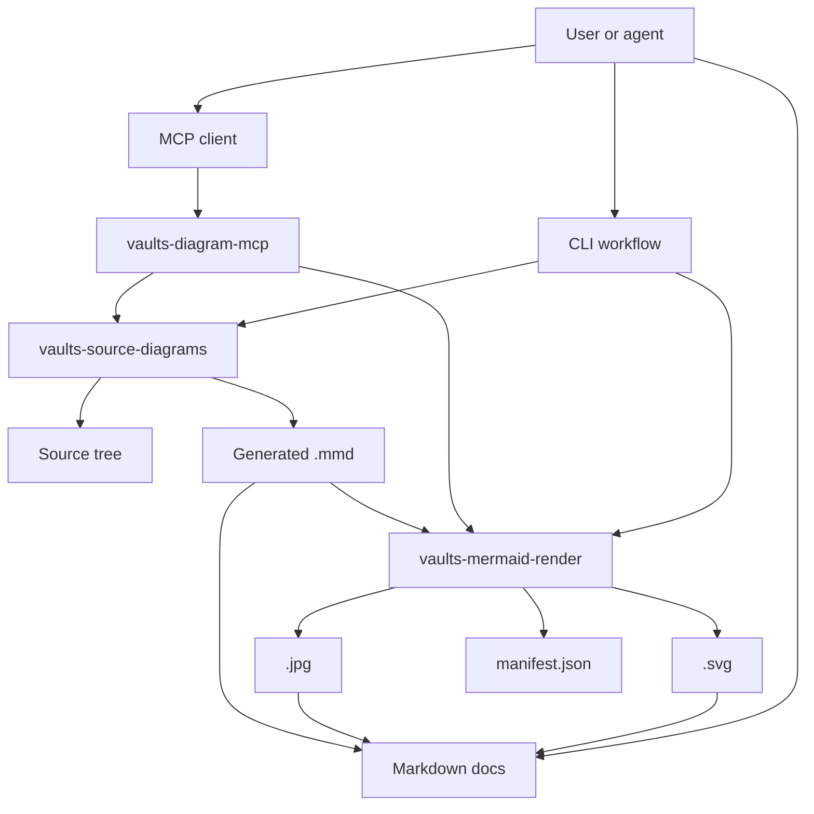
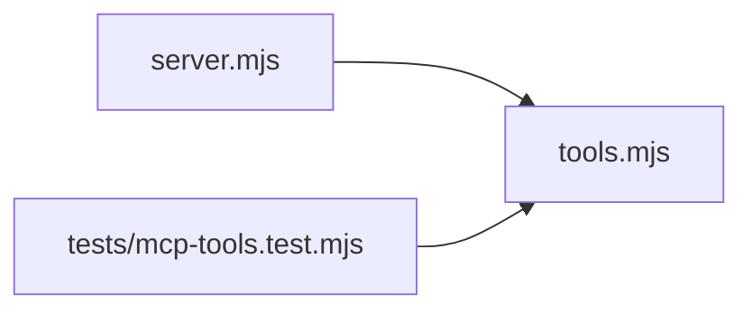

# vaults-diagram-tools

Portable diagram automation for teams that need reproducible Mermaid assets, source-code diagrams, and MCP workflows without Vault-specific content.

- [GitHub repository](https://github.com/malnati/vaults-diagram-tools)
- [npm package `vaults-diagram-tools@0.1.3`](https://www.npmjs.com/package/vaults-diagram-tools/v/0.1.3)
- [MCP Registry `io.github.Malnati/vaults-diagram-tools`](https://registry.modelcontextprotocol.io/v0/servers?search=io.github.Malnati%2Fvaults-diagram-tools)
- [Smithery server](https://smithery.ai/servers/ricardomalnati/vaults-diagram-tools)
- [GitHub release v0.1.1](https://github.com/Malnati/vaults-diagram-tools/releases/tag/v0.1.1)
- [GitHub App](https://github.com/apps/vaults-diagram-tools)

## Quick start

Install in a project:

```bash
npm install -D vaults-diagram-tools
```

Render one Mermaid source to durable assets:

```bash
npx vaults-mermaid-render diagram.mmd --output-dir out --manifest out/manifest.json
```

Generate Mermaid diagrams from source code:

```bash
npx vaults-source-diagrams --source-dir src --output-dir diagrams
```

Run the MCP stdio server:

```bash
npx vaults-diagram-mcp
```

Use one-shot `npx` when the project should not keep a dependency:

```bash
npx --yes --package vaults-diagram-tools vaults-mermaid-render diagram.mmd --output-dir out
npx --yes --package vaults-diagram-tools vaults-source-diagrams --source-dir src --output-dir diagrams
npx --yes --package vaults-diagram-tools vaults-diagram-mcp
```

## Core tools

| Command | Purpose |
| --- | --- |
| `vaults-mermaid-render` | Render `.mmd` or `.mermaid` files to SVG/JPEG, manifests, and optional PNG/text sidecars. |
| `vaults-source-diagrams` | Generate Mermaid diagrams from source-code structure, including focused selections and traceability metadata. |
| `vaults-diagram-mcp` | Expose `render_mermaid_text`, `render_mermaid_file`, and `generate_source_diagrams` through MCP stdio. |

## Workflows

- **Markdown docs:** keep the Mermaid source as a linked `.mmd`, render `.svg` and `.jpg`, and show source inline with a fenced `mermaid` block.
- **Source graph reviews:** generate diagrams from real source paths and inspect manifest selection data for requested files, omitted connectors, and rendered outputs.
- **Agent automation:** use the MCP server when clients need diagram rendering through a narrow, explicit tool surface. Current MCP Registry status is `active` at version `0.1.3`.

## Download and distribution

### npm registry

Current npm latest is [`vaults-diagram-tools@0.1.3`](https://www.npmjs.com/package/vaults-diagram-tools/v/0.1.3).

```bash
npm install -D vaults-diagram-tools
```

### GitHub package and local checkout

```bash
npm install github:malnati/vaults-diagram-tools
git clone https://github.com/malnati/vaults-diagram-tools.git
cd vaults-diagram-tools
npm ci
npm test
```

### GitHub release assets

The latest GitHub Release and GHCR image remain `v0.1.1`; npm and MCP Registry metadata are at `0.1.3`.

- [vaults-diagram-tools-0.1.1.tgz](https://github.com/Malnati/vaults-diagram-tools/releases/download/v0.1.1/vaults-diagram-tools-0.1.1.tgz)
- [vaults-diagram-tools-0.1.1.zip](https://github.com/Malnati/vaults-diagram-tools/releases/download/v0.1.1/vaults-diagram-tools-0.1.1.zip)
- `ghcr.io/malnati/vaults-diagram-tools:v0.1.1`

### Container

```bash
docker run --rm \
  -v "$PWD/examples/simple:/work/input:ro" \
  -v "$PWD/tmp/container-output:/work/output:rw" \
  ghcr.io/malnati/vaults-diagram-tools:v0.1.1 \
  --output-dir /work/output /work/input/flowchart.mmd
```

### MCP registries

- [MCP Registry](https://registry.modelcontextprotocol.io/v0/servers?search=io.github.Malnati%2Fvaults-diagram-tools): `io.github.Malnati/vaults-diagram-tools`, status `active`, version `0.1.3`.
- [Smithery](https://smithery.ai/servers/ricardomalnati/vaults-diagram-tools): `ricardomalnati/vaults-diagram-tools` is published.
- [PR #17](https://github.com/Malnati/vaults-diagram-tools/pull/17) aligned the MCP Registry publisher name.

### CDN facade

The package is CLI-first. CDN endpoints expose browser-safe metadata/helpers only; SVG/JPEG rendering still runs through Node.js, MCP, or the container runtime.

```text
https://cdn.jsdelivr.net/npm/vaults-diagram-tools/packaging/cdn/vaults-diagram-tools.mjs
https://unpkg.com/vaults-diagram-tools/packaging/cdn/vaults-diagram-tools.mjs
```

## Dracula diagram examples

The diagrams below were generated by this repository with `vaults-mermaid-render --theme dracula`. Markdown links the generated assets instead of embedding SVG/JPEG.

#### Install and usage flow
- Links: [Mermaid source](assets/diagrams/install-usage-flow.mmd) / [SVG](assets/diagrams/install-usage-flow.svg) / [JPEG](assets/diagrams/install-usage-flow.jpg)



#### Tooling architecture
- Links: [Mermaid source](assets/diagrams/tooling-architecture.mmd) / [SVG](assets/diagrams/tooling-architecture.svg) / [JPEG](assets/diagrams/tooling-architecture.jpg)



#### MCP package source graph
- Links: [Generated index](assets/diagrams/mcp-source/INDEX.md) / [Mermaid source](assets/diagrams/mcp-source/javascript/dependency.mmd) / [SVG](assets/diagrams/mcp-source/javascript/dependency.svg) / [JPEG](assets/diagrams/mcp-source/javascript/dependency.jpg)



## Compliance and artifact policy

- Project license: [MIT](https://github.com/Malnati/vaults-diagram-tools/blob/main/LICENSE).
- Notices: [NOTICE.md](https://github.com/Malnati/vaults-diagram-tools/blob/main/NOTICE.md) and [THIRD_PARTY_NOTICES.md](https://github.com/Malnati/vaults-diagram-tools/blob/main/THIRD_PARTY_NOTICES.md).
- License verification is part of `npm test` through `npm run license:check`.
- Dracula-themed examples credit the MIT-licensed Dracula Theme palette through `beautiful-mermaid`.
- Icon credits include Font Awesome 4, SVG Logos by Gil Barbara, and Lucide Icons via Iconify JSON packages.
- Artifact policy: keep Mermaid source as `.mmd`, render `.svg` and `.jpg`, link all three artifacts from Markdown, and use fenced `mermaid` blocks for inline source.
- Distribution proof points: npm `0.1.3`, MCP Registry `active` at version `0.1.3`, Smithery published, GitHub Release/GHCR `v0.1.1`.

## More links

- [Homebrewery package page](https://homebrewery.naturalcrit.com/share/J1w1-EjqPAr9)
- [Vaults compatibility notes](vaults-compatibility.md)
- [GitHub Container Registry package](https://github.com/malnati/vaults-diagram-tools/pkgs/container/vaults-diagram-tools)
