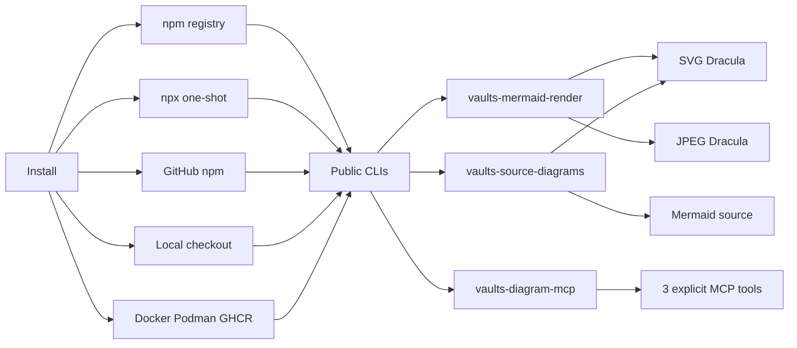
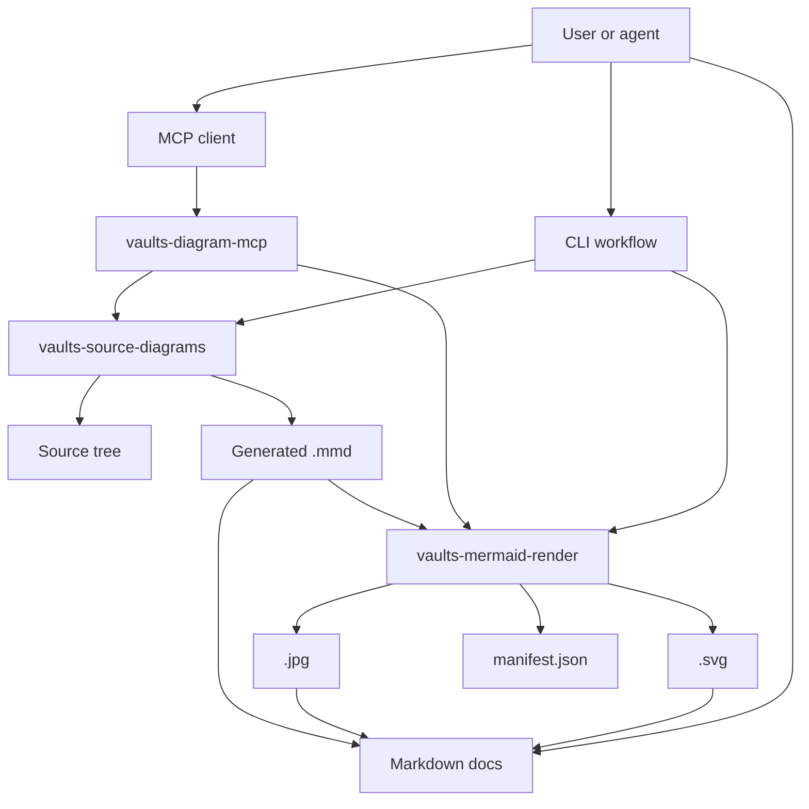

# vaults-diagram-tools

Portable Mermaid and source-code diagram toolkit for SVG/JPEG rendering, offline assets, and MCP workflows.

## Download / Install

### npm registry

```bash
npm install -D vaults-diagram-tools
npx vaults-mermaid-render diagram.mmd --output-dir out --manifest out/manifest.json
npx vaults-source-diagrams --source-dir src --output-dir diagrams
npx vaults-diagram-mcp
```

### One-shot without saving a dependency

```bash
npx --yes --package vaults-diagram-tools vaults-mermaid-render diagram.mmd --output-dir out
npx --yes --package vaults-diagram-tools vaults-source-diagrams --source-dir src --output-dir diagrams
```

### Release download

- [GitHub release v0.1.1](https://github.com/Malnati/vaults-diagram-tools/releases/tag/v0.1.1)
- [vaults-diagram-tools-0.1.1.tgz](https://github.com/Malnati/vaults-diagram-tools/releases/download/v0.1.1/vaults-diagram-tools-0.1.1.tgz)
- [vaults-diagram-tools-0.1.1.zip](https://github.com/Malnati/vaults-diagram-tools/releases/download/v0.1.1/vaults-diagram-tools-0.1.1.zip)
- `ghcr.io/malnati/vaults-diagram-tools:v0.1.1`

### GitHub package and local checkout

```bash
npm install github:malnati/vaults-diagram-tools
git clone https://github.com/malnati/vaults-diagram-tools.git
cd vaults-diagram-tools
npm ci
npm test
```

### Container

```bash
docker build -f containers/Containerfile -t vaults-diagram-tools:local .
docker run --rm -v "$PWD/examples/simple:/work/input:ro" -v "$PWD/tmp/out:/work/output:rw" ghcr.io/malnati/vaults-diagram-tools:v0.1.1 --output-dir /work/output /work/input/flowchart.mmd
```

## Core commands

| Command | Purpose |
| --- | --- |
| `vaults-mermaid-render` | Render `.mmd` or `.mermaid` files to SVG/JPEG and optional PNG/text sidecars. |
| `vaults-source-diagrams` | Generate Mermaid diagrams from source-code structure and render assets. |
| `vaults-diagram-mcp` | Run the MCP stdio server with three explicit tools. |

## Dracula SVG examples

#### Install and usage flow
- Links: [Mermaid source](assets/diagrams/install-usage-flow.mmd) / [SVG](assets/diagrams/install-usage-flow.svg) / [JPEG](assets/diagrams/install-usage-flow.jpg)



#### Tooling architecture
- Links: [Mermaid source](assets/diagrams/tooling-architecture.mmd) / [SVG](assets/diagrams/tooling-architecture.svg) / [JPEG](assets/diagrams/tooling-architecture.jpg)



#### MCP package source graph
- Links: [Generated index](assets/diagrams/mcp-source/INDEX.md) / [Mermaid source](assets/diagrams/mcp-source/javascript/dependency.mmd) / [SVG](assets/diagrams/mcp-source/javascript/dependency.svg) / [JPEG](assets/diagrams/mcp-source/javascript/dependency.jpg)

## Credits and license compliance

- Project license: [MIT](https://github.com/Malnati/vaults-diagram-tools/blob/main/LICENSE).
- Notices: [NOTICE.md](https://github.com/Malnati/vaults-diagram-tools/blob/main/NOTICE.md) and [THIRD_PARTY_NOTICES.md](https://github.com/Malnati/vaults-diagram-tools/blob/main/THIRD_PARTY_NOTICES.md).
- License verification is part of `npm test` through `npm run license:check`.
- Dracula-themed examples credit the MIT-licensed Dracula Theme palette through `beautiful-mermaid`.
- Icon credits include Font Awesome 4, SVG Logos by Gil Barbara, and Lucide Icons via Iconify JSON packages.

## Artifact policy

Keep Mermaid source as `.mmd`, render `.svg` and `.jpg`, and link all three artifacts from Markdown. Use a fenced `mermaid` block when showing source inline.

## Distribution

- npm registry package and GitHub package install flow.
- GitHub release [`v0.1.1`](https://github.com/Malnati/vaults-diagram-tools/releases/tag/v0.1.1) includes npm tarball and zip assets.
- GitHub Container Registry publishes `ghcr.io/malnati/vaults-diagram-tools:v0.1.1`.
- CDN endpoints expose browser-safe helpers only; rendering remains Node/container/MCP-side.
- Packaging templates live under `packaging/`.
- The read-only [GitHub App](https://github.com/apps/vaults-diagram-tools) is available for installs that need repository metadata access.

## More links

- [Repository](https://github.com/malnati/vaults-diagram-tools)
- [GitHub release v0.1.1](https://github.com/Malnati/vaults-diagram-tools/releases/tag/v0.1.1)
- [npm package](https://www.npmjs.com/package/vaults-diagram-tools)
- [GitHub App](https://github.com/apps/vaults-diagram-tools)
- [Homebrewery package page](https://homebrewery.naturalcrit.com/share/J1w1-EjqPAr9)
- [Vaults compatibility notes](vaults-compatibility.md)
